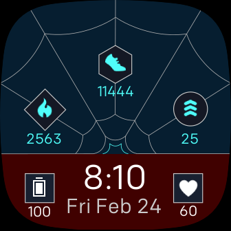
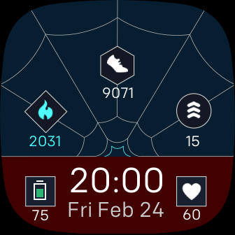
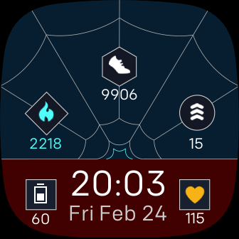
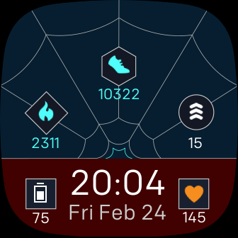
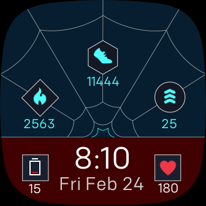

# Fitbit SM Miles Skill Tree watch face

The Skill Tree design from Insomniac's Spider-Man Miles Morales game for PS4/5 is so good that I couldn't resist making a more...portable version. 

The stats (starting from the bottom left and going clockwise):
- Battery (🔋)
    - The battery icon will turn red when at or below 25% and green while charging
- Calories (🔥)
- Steps (👟)
- Active Zone Minutes (⬆️)
- Heart Rate (💛🧡❤️)
    - The heart will change color to correspond with the current Active Zone to match Fitbit's colors.

Screenshots:

All the credit goes to the amazing work done by Gil (@GilFromUI on Twitter) and the Insomniac team on the design work that I was inspired by.

[Fitbit Gallery Link](https://gallery.fitbit.com/details/579c6239-b87e-4d4a-9305-7d0635965682)